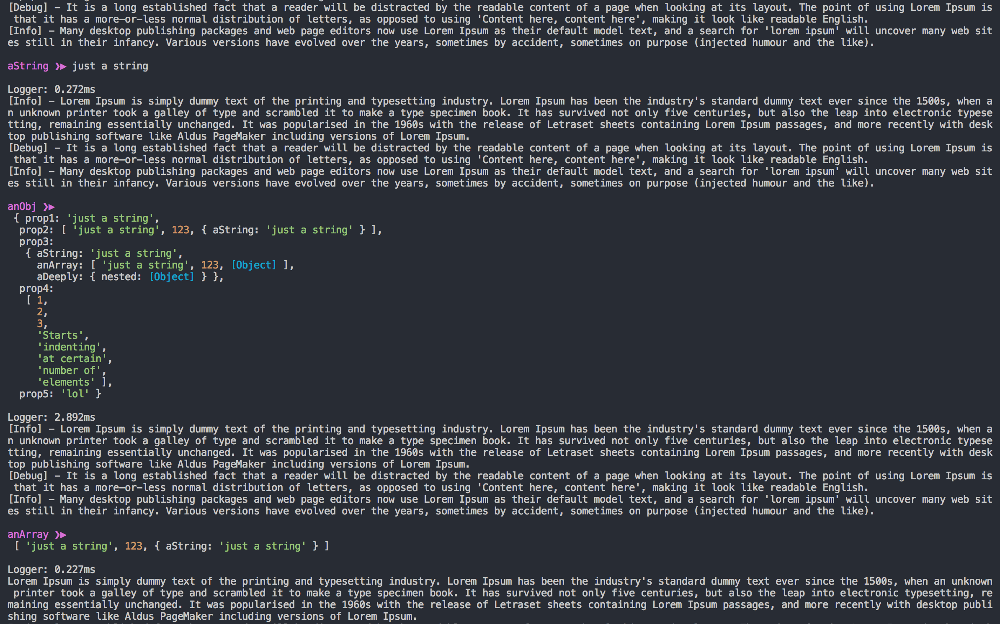
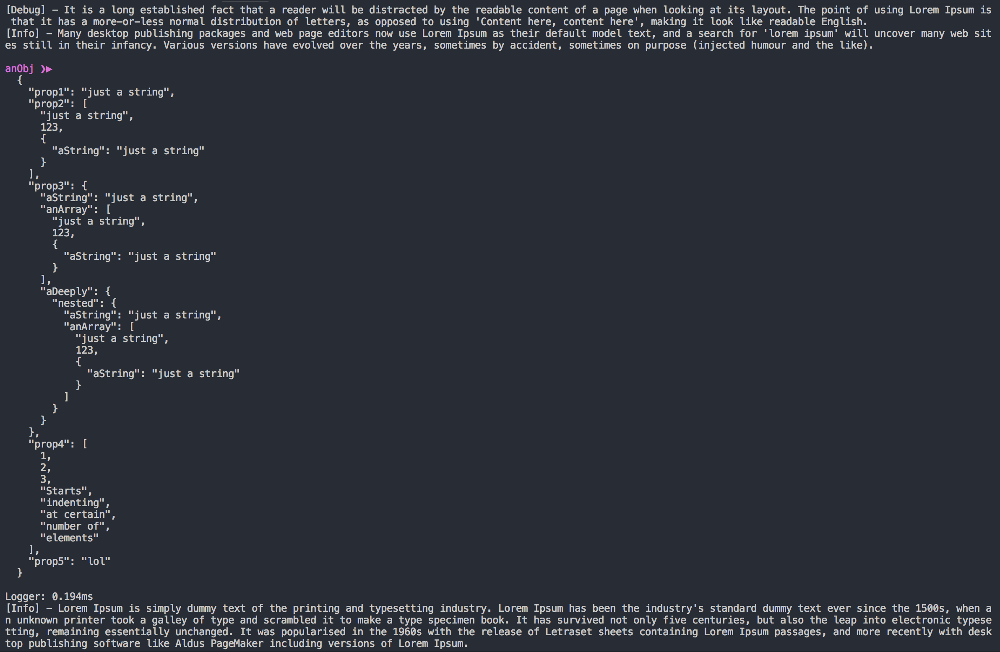

# yoLog
## What is it?

yoLog is a `comfort` utility for `troubleshooting` Node.js apps in dev.

It formats `console logs` to make them stand out from the noise, and `easy to find`.

+ Detects the variable's name, and prints it in colour before rendering its content
+ Renders the variable content in prettier and indented JSON format
+ Limits the rendering of nested properties to 2 levels deep
+ Allows full rendering of deeply nested objects when needed
+ For kicks: shows how much time the fancy logging took

See examples below.

## Install instructions
Install as an Optional Dependency
```
npm i -O yolog
```
Or as a Dev Dependency
```
npm i -D yolog
```
Then require it in your projects
```js
const yoLog = require('yolog');
```

## How to use
Instead of typing:
```js
console.log(`myVar: ${myVar}`);
// or
console.log(`myVar: ${JSON.stringify(myVar)}`);
```
just type:
```js
yoLog({myVar});
```

and if you need to be able to read the values of deeply nested properties:
```js
yoLog({myVar}, 1);
// or
yoLog({myVar}, true);
```

## Examples

For variables named and defined as:
```js
const aString = 'just a string';
const anArray = [aString, 123, {aString}];
const anObj = {
  prop1: aString,
  prop2: anArray,
  prop3: {
    aString,
    anArray,
    aDeeply: {
      nested: {
        aString,
        anArray
      }
    }
  },
  prop4: [1, 2, 3, 'Starts', 'indenting', 'at certain', 'number of', 'elements'],
  prop5: 'lol'
};
```
### Concise and colourful logs


### Deeply nested view (raw JSON)


### Why the name
+ My name is Johan, pronounced "Yoan".
+ `Y`ou `O`nly `Log` one... var at a time!

### Misc
The logs have been tested on both black and white background in:
+ Mac OS' native terminal
+ [VSCode](https://code.visualstudio.com/)'s terminal
+ [iTerm2](https://www.iterm2.com/)

Var names are shown in Magenta because it is one of the most consistant colours accross terminals.
